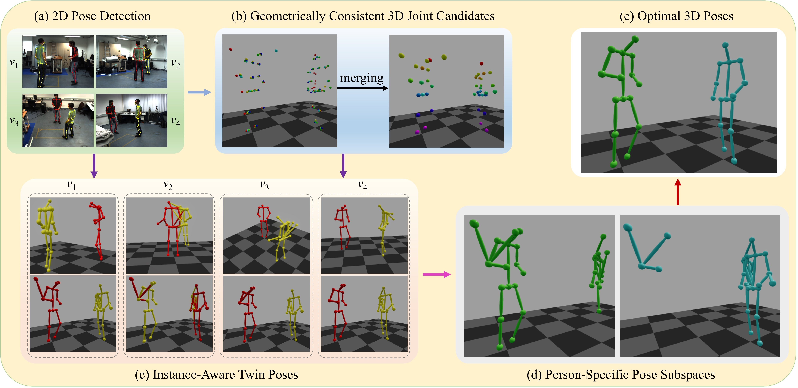
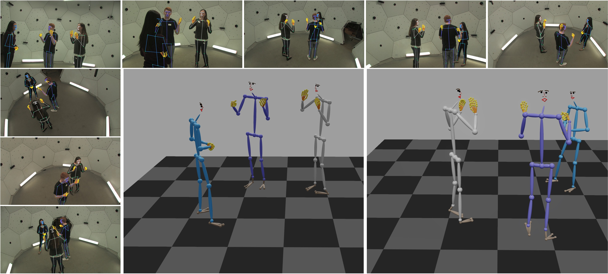

# TwinPose: Person-Specific Subspaces for Multi-View 3D Pose Estimation

## News

- **2026-06-08**: 🔗 Code is now available at [https://github.com/HYPER-THEORY/TwinPose](https://github.com/HYPER-THEORY/TwinPose).

- **2026-05-06**: 🎉 TwinPose has been accepted to **SIGGRAPH 2026 Journal Track** (ACM Transactions on Graphics)!

- **2024-11-01**: 🚀 TwinPose was successfully developed and integrated into our self-developed real-time multi-view motion capture system.

## Introduction


Following the success of deep neural networks in 2D pose estimation, reconstruction-based approaches have significantly advanced multi-person 3D pose estimation from sparse multi-view images. These methods typically detect 2D poses independently in each view and then associate them for 3D reconstruction. However, despite strong progress, recent state-of-the-art methods still face critical limitations: 1) They often depend on global optimization over a large and complex set of multi-view 2D joints to jointly infer 3D poses for all individuals, making the process highly complex and prone to suboptimal solutions; 2) Their tight coupling with the bottom-up detector OpenPose hinders the use of more advanced top-down or single-stage 2D pose estimators and restricts the integration of richer instance-level cues learned by these models.
<br><br>
To address these limitations, we propose **TwinPose**, a novel framework that alleviates the complexity of global pose inference by optimizing within **person-specific 3D pose subspaces**, while fully supporting diverse 2D pose detectors and effectively leveraging pose-instance cues. The key idea is to introduce a twin pose — a 3D counterpart of each 2D pose — that inherits its instance representation and aggregates geometrically consistent 2D joints from other views. All twin poses are unified in a common 3D space, where those belonging to the same individual naturally share a number of bones. This structural property enables association by counting shared bones, forming person-specific subspaces from which each individual’s 3D pose can be inferred independently in an efficient and robust manner.
<br><br>
Extensive experiments demonstrate that **TwinPose achieves state-of-the-art performance** in both accuracy and efficiency across multiple public and proprietary datasets. Importantly, it is **fully detector-agnostic**, allowing seamless integration with current and future advances in 2D pose estimation while remaining highly robust to noisy or imperfect 2D predictions.



## Perspective and Broader Impact

TwinPose reflects our observation-first view of multi-view 3D motion capture: the quality of 2D observations from each camera determines the upper bound of 3D pose estimation. The goal of TwinPose is to make this upper bound easier to approach in practice. By building person-specific 3D pose subspaces, TwinPose avoids heavy global optimization, supports arbitrary 2D human pose detectors, and provides a scalable framework for future improvements driven by stronger 2D pose estimation models.

This framework also connects naturally with our broader research on video-based 2D pose estimation, including **[DSTA](https://github.com/zgspose/DSTA)**, **[PAVE-Net](https://github.com/zgspose/PAVENet)**, and **[TAR-ViTPose](https://github.com/zgspose/TARViTPose)**. These works systematically explore how temporal information can be used to improve 2D pose estimation, with the hope of moving beyond the dominant single-frame paradigm toward a more robust video-based paradigm.

## Quantitative Performance

with the fastest per-frame time (e.g., 0.92 ms on Shelf) and full flexibility to work with any 2D pose detector (e.g, HRNet, RTMO, and OpenPose).

**Quantitative comparison on the Shelf dataset.**

<table>
  <thead>
    <tr><th>Method</th><th>A1</th><th>A2</th><th>A3</th><th>Avg</th><th>Time (ms)</th></tr>
  </thead>
  <tbody>
    <tr><td>Tanke and Gall [2019]</em></td><td>99.8</em></td><td>90.0</em></td><td>98.0</em></td><td>96.0</em><td>N/A</em></tr>
    <tr><td>Bridgeman et al. [2019]</em></td><td>99.3</em></td><td>91.6</em></td><td>97.6</em></td><td>96.2</em><td>9.1</em></tr>
    <tr><td>Dong et al. [2019]</em></td><td>98.8</em></td><td>94.1</em></td><td>97.8</em></td><td>96.9</em><td>90</em></tr>
    <tr><td>Chen et al. [2020a]</em></td><td>99.6</em></td><td>93.2</em></td><td>97.5</em></td><td>96.8</em><td>3.08</em></tr>
    <tr><td>Tu et al. [2020]</em></em></td><td>99.3</em></td><td>94.1</em></td><td>97.6</em></td><td>97.0</em><td>333</em></tr>
    <tr><td>Huang et al. [2020]</em></em></td><td>98.8</em></td><td>96.2</em></td><td>97.2</em></td><td>97.4</em><td>640</em></tr>
    <tr><td>Zhang et al. [2020]</em></em></td><td>99.0</em></td><td>96.2</em></td><td>97.6</em></td><td>97.6</em><td>31.9</em></tr>
    <tr><td>Dong et al. [2021]</em></em></td><td>99.1</em></td><td>93.5</em></td><td>98.1</em></td><td>96.9</em><td>N/A</em></tr>
    <tr><td>Wang et al. [2021]</em></em></em></td><td>99.3</em></td><td>95.1</em></td><td>97.8</em></td><td>97.4</em><td>~170</em></tr>
    <tr><td>Wu et al. [2021]</em></em></em></td><td>99.3</em></td><td>96.5</em></td><td>97.3</em></td><td>97.7</em><td>~48.8</em></tr>
    <tr><td>Reddy et al. [2021]</em></em></em></em></td><td>99.1</em></em></td><td>96.3</em></em></td><td>98.3</em></em></td><td>97.9</em></em></td><td>>333</em></em></tr>
    <tr><td>Lin and Lee [2021]</em></em></em></td><td>99.3</em></em></td><td>96.5</em></em></td><td>98.0</em></em></td><td>97.9</em></em></td><td>23.4</em></em></tr>
    <tr><td>Zhang et al. [2021]</em></em></em></em></td><td>99.5</em></em></td><td><strong>97.0</strong></em></em></td><td>97.8</em></em></td><td>98.1</em></em></td><td>>31.9</em></em></tr>
    <tr><td>Zhou et al. [2022]</em></em></em></em></td><td>99.5</em></em></td><td>96.7</em></em></td><td>98.2</em></em></td><td>98.1</em></em></td><td>2.94</em></em></tr>
    <tr><td>Choudhury et al. [2023]</em></em></em></em></em></td><td>99.0</em></em></td><td>96.3</em></em></td><td>98.2</em></em></td><td>97.8</em></em></td><td>N/A</em></em></tr>
    <tr><td>Liao et al. [2024]</em></em></em></em></em></td><td>99.5</em></em></td><td>96.8</em></em></td><td>97.8</em></em></td><td>98.0</em></em></td><td>210</em></em></tr>
    <tr><td><strong>TwinPose (Ours)</strong></em></em></em></em></em></td><td><strong>99.8</strong></em></em></em></em></em></td><td>96.2</em></em></em></em></em></td><td><strong>98.5</strong></em></em></em></em></em></td><td><strong>98.2</strong></em></em></em></em></em></td><td><strong>0.92</strong></em></em></em></em></em></tr>
  </tbody>
</table>

**Quantitative comparison on the 4DA dataset.**

<table>
  <thead>
    <tr><th>Method</th><th>2D Detector</th><th>Precision (%)</th><th>Recall (%)</th></tr>
  </thead>
  <tbody>
    <tr><td colspan="4"><em>Methods tightly coupled to the bottom‑up detector OpenPose</em></td></tr>
    <tr><td>Zhang et al. [2020]</td><td>OpenPose</td><td>88.5</td><td>90.2</td></tr>
    <tr><td>Dong et al. [2021]</td><td>OpenPose</td><td>90.1</td><td>89.0</td></tr>
    <tr><td>Zhou et al. [2022]</td><td>OpenPose</td><td>92.0</td><td>91.2</td></tr>
    <tr><td colspan="4"><em>Detector‑agnostic methods (any 2D pose detector)</em></td></tr>
    <tr><td>Dong et al. [2019]</td><td>OpenPose</td><td>78.5</td><td>77.1</td></tr>
    <tr><td>Dong et al. [2019]</td><td>HRNet</td><td>84.9</td><td>84.9</td></tr>
    <tr><td>Dong et al. [2019]</td><td>RTMO</td><td>85.4</td><td>85.5</td></tr>
    <tr><td><strong>TwinPose (Ours)</strong></td><td>OpenPose</td><td>91.4</td><td>90.4</td></tr>
    <tr><td><strong>TwinPose (Ours)</strong></td><td>HRNet</td><td>94.3</td><td>93.2</td></tr>
    <tr><td><strong>TwinPose (Ours)</strong></td><td>RTMO</td><td><strong>94.8</strong></td><td><strong>95.0</strong></td></tr>
  </tbody>
</table>

**Quantitative comparison on the Hi4D dataset.**

<table>
  <thead>
    <tr><th>Method</th><th>MPJPE ↓</th><th>PCP ↑</th><th>AP₅₀ ↑</th><th>AP₁₀₀ ↑</th><th>Recall ↑</th></tr>
  </thead>
  <tbody>
    <tr><td>Dong et al. [2019]</td><td>53.05</td><td>87.57</td><td>67.97</td><td>80.28</td><td>93.80</td></tr>
    <tr><td>Zhang et al. [2020]</td><td>41.29</td><td>88.62</td><td>80.87</td><td>97.27</td><td>98.78</td></tr>
    <tr><td>Lu et al. [2024a]</td><td>32.10</td><td>96.90</td><td><strong>91.48</strong></td><td>97.33</td><td>98.78</td></tr>
    <tr><td><strong>TwinPose (Ours)</strong></td><td><strong>22.00</strong></td><td><strong>99.71</strong></td><td>90.80</td><td><strong>99.34</strong></td><td><strong>99.86</strong></td></tr>
  </tbody>
</table>

## Qualitative Results

**Comparison with skeleton-level association method [Dong et al. 2019].** Traditional skeleton-level association approaches indiscriminately use all joints and bones, leading to incorrect associations (red boxes). TwinPose preserves only cross-view geometrically consistent joints, substantially improving robustness.


**Comparison with the state-of-the-art 4DA method [Zhang et al. 2020].** Global optimization in 4DA causes incorrect cross-person associations (red boxes). TwinPose performs person-specific inference in pose subspaces, enhancing both robustness and efficiency.


**Whole-body 3D pose estimation results of our method on the Panoptic dataset.** Results from eight camera views demonstrate consistent multi-view reconstructior
of body, hands, feet, and facial keypoints.



## Video Demo

For a complete video demonstration of our methods, please see [this YouTube video](https://youtu.be/XLDARAOr0j0).

https://github.com/user-attachments/assets/3a5020d2-9cf9-4019-88bd-4c775576d548

## Citations

If you find our paper useful in your research, please consider citing:

```bibtex
@article{yang2026twinpose,
  title         = {TwinPose: Person-Specific Subspaces for Multi-View 3D Pose Estimation},
  author        = {Yang, Wenwu and He, Tianyi and Ding, Jiwei and Wang, Xun and Zhang, Rong and Zhou, Kun},
  journal       = {ACM Transactions on Graphics},
  volume        = {45},
  number        = {4},
  articleno     = {61},
  year          = {2026},
  note          = {SIGGRAPH 2026 Journal Track}
}

@article{yang2023lightweight,
  title         = {Lightweight Multi-Person Motion Capture System in the Wild},
  author        = {Yang, Wenwu and Li, Yue and Xing, Shuai and Cai, Jiahang and Wang, Xun},
  journal       = {SCIENTIA SINICA Informationis},
  volume        = {53},
  number        = {11},
  pages         = {2230--2249},
  year          = {2023},
  note          = {In Chinese}
}
```

## Acknowledgement

We thank Tianyi He for implementing the TwinPose algorithm; Jiwei Ding for his assistance with the quantitative and qualitative experiments; Yihui Sun and Bin Zhou for their assistance with the experiments on whole-body 3D pose estimation and learning-based methods; Siying Chen for video editing and homepage development; Xiongbin Lin for video editing; and all participants who contributed to the motion capture data collection. 
